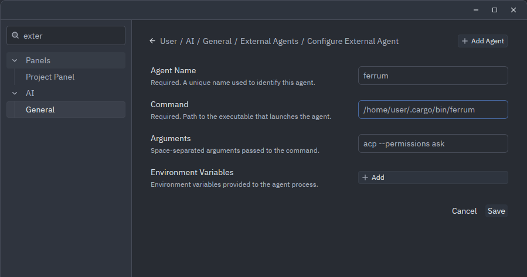
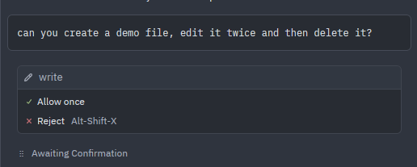

# Using Ferrum in Zed

[Zed](https://zed.dev/) can run Ferrum as a custom External Agent over the Agent Client Protocol (ACP). Zed hosts the thread UI, while Ferrum owns its provider, authentication, model, tools, instructions, safety policy, and durable sessions.

Zed's native Agent model selection does not change the provider or model used by Ferrum.

## Prerequisites

Install and configure Ferrum before adding it to Zed:

```bash
ferrum --version
ferrum acp --help
command -v ferrum
```

Use Ferrum normally in a terminal first to complete provider authentication and verify its configuration. Ferrum reads its existing user configuration and OAuth storage when Zed launches it.

Use the absolute path printed by `command -v ferrum` in Zed. GUI applications may not inherit the same `PATH` as an interactive shell.

## Add Ferrum as an External Agent

In Zed:

1. Open the Command Palette.
2. Run `agent: open settings`.
3. Open **External Agents**.
4. Select **Add Agent**, then **Add Custom Agent**.
5. Configure the Ferrum executable and ACP arguments.

The equivalent `settings.json` entry is:

```json
{
  "agent_servers": {
    "ferrum": {
      "type": "custom",
      "command": "/absolute/path/to/ferrum",
      "args": ["acp"],
      "env": {}
    }
  }
}
```

Replace `/absolute/path/to/ferrum` with the output of `command -v ferrum`. Add `agent_servers` at the top level of the existing settings object; do not replace unrelated Zed settings.

With only `acp` in the argument list, Ferrum applies its own safety and tool policy without asking Zed to confirm each authorized tool call. This is the recommended configuration for normal use.

Restart Zed if Ferrum does not appear after saving the settings file.

## Optional Zed confirmations

Add `--permissions ask` when you want Zed to ask before each sensitive operation that Ferrum has already authorized:

```json
{
  "agent_servers": {
    "ferrum": {
      "type": "custom",
      "command": "/absolute/path/to/ferrum",
      "args": ["acp", "--permissions", "ask"],
      "env": {}
    }
  }
}
```



Zed may approve or reject these requests, but approval cannot bypass Ferrum's safety tier, tool policy, path policy, shell guards, or protected-target checks.

Ferrum intentionally offers only non-persistent **Allow once** and **Reject** choices. There is no allow-all choice in this mode, so use plain `acp` instead when you do not want per-operation prompts.



## Start a Ferrum thread

1. Open the project Ferrum should work in. Trust the project in Zed only when you trust its contents.
2. Open the Agent Panel or Threads Sidebar.
3. Create a new External Agent thread and select `ferrum`.
4. Send `/version` to verify the running Ferrum version.
5. Send `/session` to inspect the active provider, model, tools, working directory, and policy.

A simple first request is:

```text
Inspect this project and summarize its package structure. Cite the files you read.
```

Ferrum uses the canonical project working directory supplied by Zed. Its current ACP baseline does not accept additional workspace directories, so start the thread from the project root you want Ferrum to use.

## Configuration boundaries

External Agent threads preserve a clear boundary between Zed and Ferrum:

| Concern | Controlled by |
|---|---|
| Thread UI and ACP client | Zed |
| Provider, model, and provider authentication | Ferrum |
| Native tools and execution safety | Ferrum |
| ACP permission response | Zed, when `--permissions ask` is enabled |
| `AGENTS.md`, `.ferrum/config.toml`, and Ferrum skills | Ferrum |
| Ferrum JSONL session persistence | Ferrum |

Ferrum loads `~/.config/ferrum/config.toml` and the nearest restrictive `.ferrum/config.toml` for the session working directory. Project policy can narrow tools, roots, skills, MCP access, safety, and tool-round limits. It cannot broaden user-level policy or configure provider credentials.

Do not copy API keys or OAuth tokens into Zed's `agent_servers.ferrum.env`. Configure provider authentication through Ferrum.

## Commands and history

Ferrum advertises these ACP-safe commands to Zed:

```text
/version
/session
/compact [instructions]
```

Ferrum session IDs refer to its durable JSONL sessions. Zed can list, import, load, resume, close, and delete sessions through the ACP methods Ferrum supports. A resumed session must use the same canonical working directory.

Terminal-only Ferrum commands such as `/quit` are not available inside an ACP thread.

## MCP servers

Zed may forward configured stdio MCP servers to External Agents over ACP. Ferrum merges accepted client-supplied servers with its enabled native MCP configuration for that session.

Current limits:

- Client-supplied MCP servers must use stdio and an absolute executable path.
- HTTP and SSE definitions are rejected.
- Server names and sanitized tool names must not collide.
- Client-supplied MCP definitions must be sent again when a session is loaded or resumed after process restart.
- Ferrum's MCP and tool policy still applies.

Avoid configuring the same MCP server independently in both Zed and Ferrum unless the names and tools are intentionally distinct.

## Troubleshooting

### Ferrum is missing from the agent selector

- Validate `~/.config/zed/settings.json` as JSON.
- Confirm `agent_servers` is a top-level key.
- Use an absolute Ferrum executable path.
- Restart Zed after changing the custom agent definition.
- Open Zed's Command Palette and run `dev: open acp logs`.

### The agent starts but authentication fails

Run Ferrum directly in a terminal and complete its normal login flow. Zed's native model-provider credentials are not automatically Ferrum credentials.

### Tool calls are missing or denied

Send `/session` in the Ferrum thread and inspect:

- safety level;
- exposed tools;
- readable and writable roots;
- MCP status;
- nearest `.ferrum/config.toml`.

Zed permission approval cannot override a Ferrum denial. See [Security](security.md), [Tools](tools.md), and [Configuration](config.md).

### Zed asks before every sensitive tool call

This is expected when the custom agent arguments contain:

```json
["acp", "--permissions", "ask"]
```

Ferrum's ACP permission mode intentionally offers one-time decisions only. Change the arguments to `["acp"]`, then start a new Ferrum thread, when you do not want confirmation prompts.

### Protocol or process errors

Run `dev: open acp logs` in Zed. Ferrum keeps ACP stdout reserved for newline-delimited JSON-RPC and writes sanitized diagnostics to stderr. Include the ACP log when reporting an interoperability problem.

See [Ferrum ACP support](acp.md) and [Zed External Agents](https://zed.dev/docs/ai/external-agents) for the protocol and client-side details.
